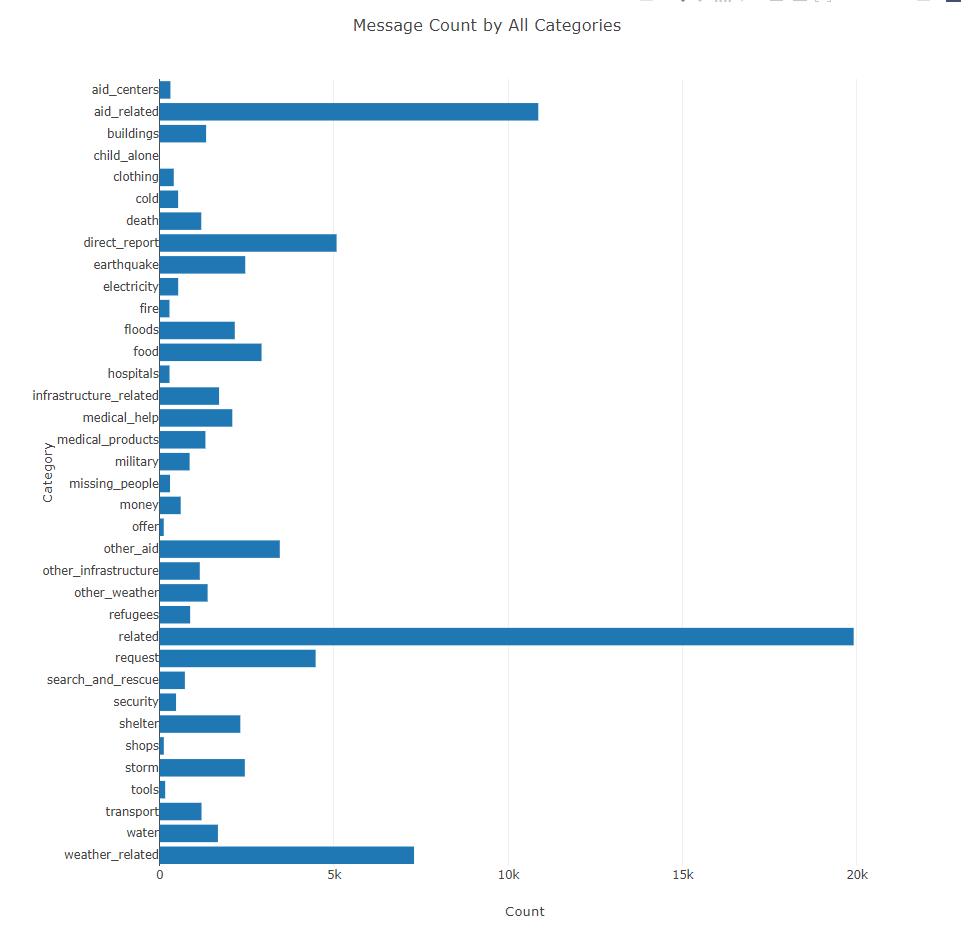

### Disaster Response Pipeline Project

#### motivation:

The purpose of this project is to build a machine learning model to predict the relevant categories for a given message.
Such a tool can be useful for improving the efficiency of handling large volumes of incoming messages during a desaster & contribute to a faster response.


#### Description:

This project contains:

1. ETL - process_data.py - which reads data from two csv files, messages & their respective categories, cleans the data and stores it in a SQLite database.


2. ML Pipeline - train_classifier.py - which splits the data to train and test sets, builds & tunes and a model to predict the categories of a new message, outputs results on the test set & saves the model.


3. Flask App - run.py - which displays statistical visualization of the training data set & displays the predicted categories of an input text. (see image below)

#### Structure:    
 
```bash
├── app
│   ├── template
│   │   ├── go.html     # classification result page of web app
│   │   └── master.html # main page of web app 
│   └── run.py          # Flask file that runs app  
├── data
│   ├── disaster_categories.csv #  data to process
│   ├── disaster_messages.csv   # data to process
│   ├── process_data.py
│   └── DisasterResoponse.db
├── models
│   ├── classifier.pkl          # saved model 
│   └── train_classifier.py
└── README.MD
``` 

#### Installation:
Conda installation should be sufficient.</br>
Unpack the file workspace.tar.gz which contains the tree described above.

#### Instructions:
1. Run the following commands in the project's root directory to set up the database and model.

    - To run ETL pipeline that cleans data and stores in database
        `python data/process_data.py data/disaster_messages.csv data/disaster_categories.csv data/DisasterResponse.db`
    - To run ML pipeline that trains classifier and saves
        `python models/train_classifier.py data/DisasterResponse.db models/classifier.pkl`

2. Run the following command in the app's directory to run your web app.
    `python run.py`

3. Go to http://0.0.0.0:3001/

#### acknowledgments
This project is a part of Udacity Data Schientist Nano Degree in cooperation with Figure Eight.

#### App Screenshot

